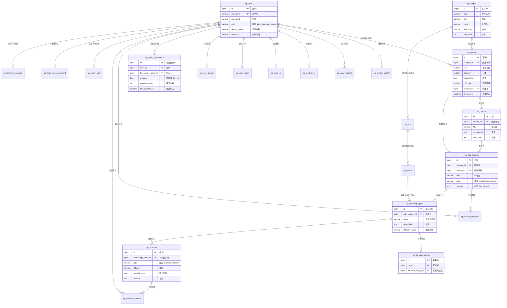
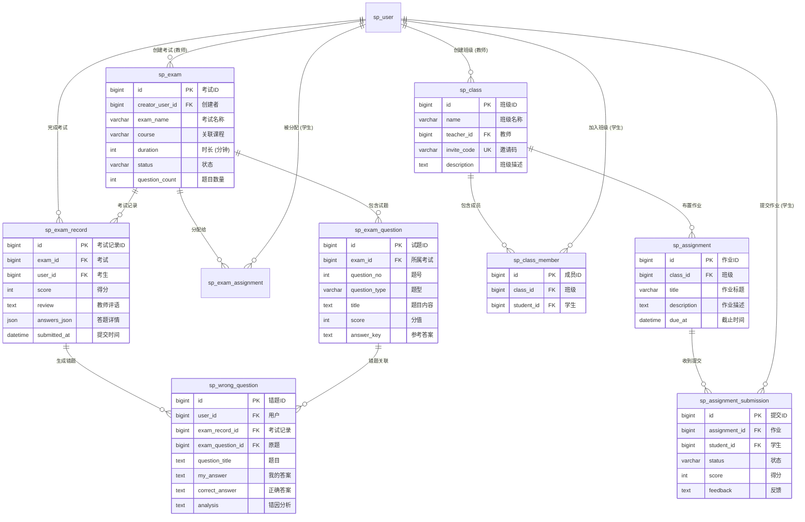
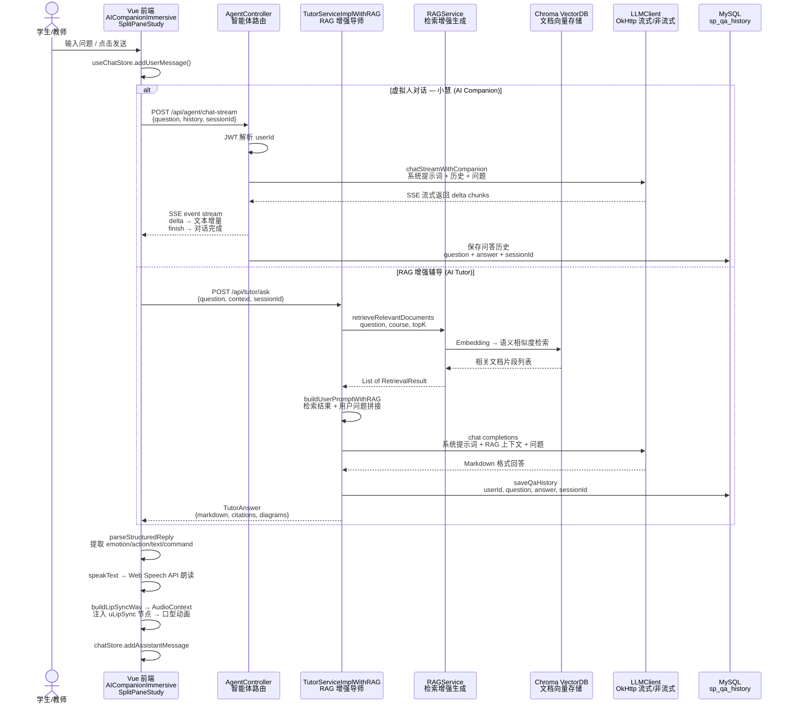
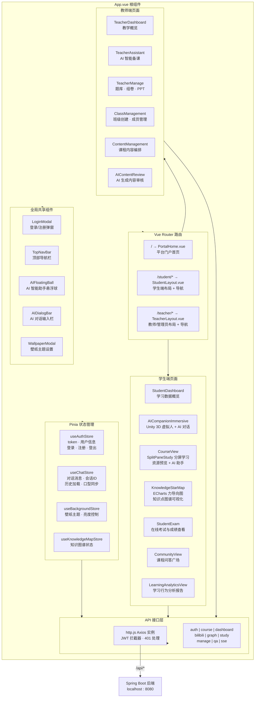
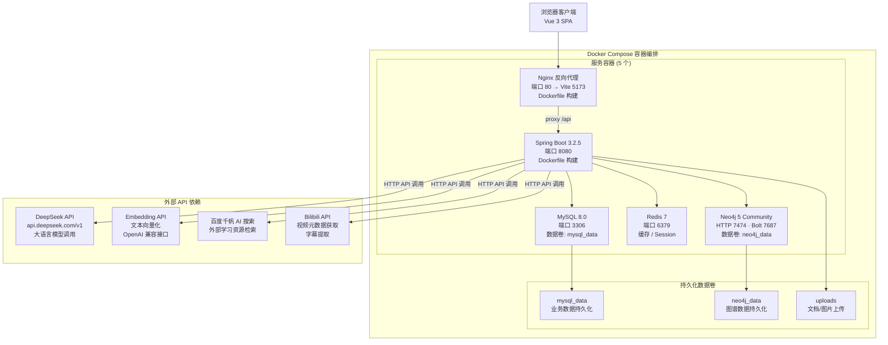

# 知域智备优教 (SmartPrep) — 系统架构文档

> 生成日期: 2026-06-14 | 分支: master

---

## 目录

1. [系统架构图](#1-系统架构图)
2. [数据库 ER 图](#2-数据库-er-图)
3. [AI 对话与 RAG 数据流](#3-ai-对话与-rag-数据流)
4. [前端组件架构](#4-前端组件架构)
5. [部署架构](#5-部署架构)

---

## 1. 系统架构图

```mermaid
graph TB
    subgraph 客户端层["🖥️ 客户端层"]
        Browser["浏览器客户端<br/>Vue 3 SPA + WebGL<br/>Unity 3D 虚拟人"]
    end

    subgraph 网关层["🔐 网关/安全层"]
        Nginx["Nginx 反向代理<br/>静态资源托管 + API 转发"]
        JWT_Auth["JWT 认证拦截器<br/>AuthInterceptor<br/>RoleCheckInterceptor"]
    end

    subgraph 应用层["⚙️ 应用层 (Spring Boot 3.2.5)"]
        subgraph 门户认证["🔑 门户与认证"]
            AuthCtrl["用户认证<br/>登录 · 注册 · 用户信息<br/>JWT Token 签发"]
            CommonCtrl["门户首页<br/>Hero 统计 · 课程列表<br/>数据中心大屏"]
        end

        subgraph 教学核心["📚 教学核心"]
            CourseCtrl["课程体系管理<br/>学科 → 课程 → 章 → 节<br/>资源 · 公告 · Q&A"]
            DashboardCtrl["教学仪表盘<br/>教师/学生工作台<br/>考试管理 · 成绩榜"]
            ScheduleCtrl["周课程表<br/>排课 · 调课"]
            ClassCtrl["班级管理<br/>班级创建 · 成员管理<br/>作业布置 · 批阅"]
        end

        subgraph AI引擎["🤖 AI 引擎层"]
            TutorSvc["RAG 增强 AI 导师<br/>TutorServiceImplWithRAG<br/>流式 + 非流式回答<br/>文档检索增强生成"]
            AgentSvc["多智能体路由<br/>AgentService<br/>课程推荐 · 知识讲解<br/>学情诊断 · 路径规划<br/>Unity 虚拟人对话"]
            LLMClient["大模型调用客户端<br/>LLMClient<br/>OpenAI 兼容 HTTP API<br/>OkHttp 流式/非流式"]
            RAG系统["RAG 检索增强生成<br/>文档解析 · 切片<br/>向量化 · 语义检索<br/>Apache PDFBox/POI/Tika<br/>Chroma VectorDB"]
            多智能体["多智能体资源生成<br/>讲义生成 · 题库构建<br/>思维导图 · 视频脚本<br/>编程实验 · 联网搜索"]
            语音服务["语音交互服务<br/>TTS 语音合成<br/>STT 语音识别<br/>Web Speech API 前端实现"]
        end

        subgraph 知识图谱["🧠 知识图谱"]
            KGService["知识点掌握分析<br/>KnowledgeGraphService<br/>ELO 算法追踪<br/>薄弱点识别 · 推荐"]
            NeoSync["图谱同步服务<br/>KnowledgeGraphSyncService<br/>MySQL → Neo4j 同步<br/>学科/课程/知识点/依赖"]
        end

        subgraph 数据分析["📊 数据分析"]
            AnalyticsCtrl["学习行为追踪<br/>AnalyticsController<br/>活动记录 · 任务完成<br/>学习时长统计"]
            AbilityCtrl["六维能力评估<br/>StudentAbilityController<br/>广度 · 深度 · 解题<br/>活跃 · 迁移 · 韧性"]
            Gamification["游戏化激励<br/>GamificationService<br/>XP 经验 · 等级 · 徽章<br/>打卡 · 排行榜 · 挑战"]
        end

        subgraph 内容工具["🛠️ 内容工具"]
            Bilibili导入["Bilibili 视频导入<br/>视频解析 · AI 分类<br/>讲义/习题自动生成<br/>视频 → 课程自动化"]
            教师工具["教师工具箱<br/>TeacherToolService<br/>题库管理 · 组卷<br/>PPT 模板 · AI 课件"]
            自适应测验["自适应测验<br/>AdaptiveQuizService<br/>难度自适应出题<br/>错因智能分析"]
        end
    end

    subgraph 数据层["🗄️ 数据层"]
        MySQL[("MySQL 8.0<br/>主业务数据库<br/>46 张表 · 63 外键")]
        Redis[("Redis 7<br/>缓存加速<br/>Session 管理")]
        Neo4j[("Neo4j 5 Community<br/>知识图谱存储<br/>知识点依赖关系")]
        Chroma[("Chroma VectorDB<br/>文档向量存储<br/>语义相似度检索")]
    end

    subgraph 外部服务["🌐 外部服务"]
        LLM_API["DeepSeek API<br/>OpenAI 兼容协议<br/>对话补全 / 流式输出"]
        BaiduSearch["百度千帆 AI 搜索<br/>外部学习资源检索"]
        BilibiliAPI["Bilibili API<br/>视频元数据获取"]
        EmbeddingAPI["Embedding API<br/>文本向量化<br/>OpenAI 兼容接口"]
    end

    %% 客户端 → 网关
    Browser --> Nginx
    Nginx --> JWT_Auth

    %% 网关 → 应用层
    JWT_Auth --> AuthCtrl
    JWT_Auth --> CommonCtrl
    JWT_Auth --> CourseCtrl
    JWT_Auth --> DashboardCtrl
    JWT_Auth --> ScheduleCtrl
    JWT_Auth --> ClassCtrl

    %% 应用层内部依赖
    DashboardCtrl --> TutorSvc
    CourseCtrl --> CourseCtrl

    TutorSvc --> RAG系统
    TutorSvc --> LLMClient
    AgentSvc --> LLMClient
    AgentSvc --> KGService
    多智能体 --> LLMClient
    RAG系统 --> LLMClient
    AnalyticsCtrl --> LLMClient

    LLMClient --> LLM_API
    RAG系统 --> Chroma
    RAG系统 --> EmbeddingAPI
    KGService --> Neo4j
    NeoSync --> Neo4j
    NeoSync --> MySQL
    Bilibili导入 --> LLMClient
    Bilibili导入 --> BilibiliAPI
    BaiduSearch --> BaiduSearch

    %% 应用层 → 数据层
    AuthCtrl --> MySQL
    CourseCtrl --> MySQL
    DashboardCtrl --> MySQL
    KGService --> MySQL
    Gamification --> MySQL
    自适应测验 --> MySQL
    教师工具 --> MySQL
    AnalyticsCtrl --> MySQL
    RAG系统 --> MySQL

    AuthCtrl --> Redis
    DashboardCtrl --> Redis
```



---

## 2. 数据库 ER 图

### 2.1 核心教学域 — 用户 · 课程 · 知识体系



### 2.2 考试与班级域 — 测评 · 组班 · 作业



### 2.3 游戏化与分析域 — 激励 · 能力 · 问答

```mermaid
erDiagram
    sp_user ||--|| sp_user_xp : "经验等级"
    sp_user ||--|| sp_user_streak : "连续打卡"
    sp_user ||--o{ sp_user_badge : "获得徽章"
    sp_badge_def ||--o{ sp_user_badge : "徽章定义"

    sp_user ||--o{ sp_learning_activity : "学习活动"
    sp_user ||--o{ sp_task_completion : "任务完成"
    sp_user ||--o{ sp_study_duration : "学习时长"
    sp_user ||--o{ sp_student_ability : "能力评估"

    sp_user ||--o{ sp_course_question : "发起提问"
    sp_course ||--o{ sp_course_question : "课程讨论"
    sp_course_question ||--o{ sp_course_answer : "收到回答"
    sp_user ||--o{ sp_course_answer : "回答问题"

    sp_user_xp {
        bigint id PK "经验ID"
        bigint user_id FK_UK "用户"
        int current_xp "当前经验值"
        int level "等级"
        varchar title "称号"
    }

    sp_user_streak {
        bigint id PK "打卡ID"
        bigint user_id FK_UK "用户"
        int current_streak "当前连续天数"
        int longest_streak "最长连续天数"
        date last_checkin_date "最后打卡日期"
        int total_checkins "总打卡次数"
    }

    sp_badge_def {
        bigint id PK "徽章定义ID"
        varchar name "徽章名称"
        text description "描述"
        varchar icon "图标"
        varchar color "颜色"
        text unlock_rule "解锁规则"
    }

    sp_user_badge {
        bigint id PK "记录ID"
        bigint user_id FK "用户"
        bigint badge_id FK "徽章"
        datetime unlocked_at "解锁时间"
    }

    sp_student_ability {
        bigint id PK "能力评估ID"
        bigint user_id FK "用户"
        float breadth_score "广度得分"
        float depth_score "深度得分"
        float problem_score "解题得分"
        float activity_score "活跃得分"
        float transfer_score "迁移得分"
        float resilience_score "韧性得分"
        text diagnosis "综合诊断"
    }

    sp_learning_activity {
        bigint id PK "活动ID"
        bigint user_id FK "用户"
        date activity_date "活动日期"
        int activity_score "活跃分"
        int login_count "登录次数"
        int study_minutes "学习分钟数"
        int question_count "答题数量"
    }

    sp_course_question {
        bigint id PK "提问ID"
        bigint course_id FK "课程"
        bigint user_id FK "提问者"
        varchar title "问题标题"
        text content "问题内容"
    }

    sp_course_answer {
        bigint id PK "回答ID"
        bigint question_id FK "问题"
        bigint user_id FK "回答者"
        text content "回答内容"
        tinyint is_ai "是否AI回答"
    }
```

---

## 3. AI 对话与 RAG 数据流



---

## 4. 前端组件架构



---

## 5. 部署架构



---

## 附录: AI 图片生成提示词

如果 Mermaid 图无法满足需求，可将以下提示词复制到 Midjourney / DALL·E / Stable Diffusion 等 AI 绘图工具中生成专业架构图。

> **重要说明**：所有提示词均要求模块标题使用**中文**，技术栈名称（如 Spring Boot、MySQL、Redis）保留**英文**。

### A. 系统架构图提示词

```
Create a professional system architecture diagram for an educational platform called "知域智备优教 (SmartPrep)". 

CRITICAL RULE: All module/component TITLES must be in CHINESE. Technology names (Spring Boot, MySQL, Redis, Neo4j, Vue, WebGL, etc.) should remain in ENGLISH.

The architecture should show these layers from top to bottom:

LAYER 1 - "客户端层 (Client Layer)": A web browser icon labeled "浏览器客户端 Vue 3 SPA + WebGL (Unity 3D 虚拟人)".

LAYER 2 - "网关安全层 (Gateway Layer)": Show "Nginx 反向代理" and "JWT 认证拦截器 (AuthInterceptor + RoleCheckInterceptor)".

LAYER 3 - "应用层 (Application Layer) Spring Boot 3.2.5": Inside this layer, show 6 sub-module groups as colored boxes:
- Green box "门户与认证": 用户认证 (JWT Token), 门户首页 (Hero统计/课程列表)
- Blue box "教学核心": 课程体系管理 (学科→课程→章→节), 教学仪表盘 (教师/学生工作台), 考试管理, 班级管理
- Orange box "AI 引擎": RAG增强AI导师 (文档检索+LLM), 多智能体路由 (课程推荐/知识讲解/学情诊断/路径规划), 大模型调用客户端 (LLMClient OkHttp), RAG系统 (文档解析/向量化/Chroma VectorDB), 多智能体资源生成 (讲义/题库/思维导图), 语音交互 (TTS/STT Web Speech API)
- Purple box "知识图谱": 知识点掌握分析 (ELO追踪), MySQL→Neo4j 同步服务
- Cyan box "数据分析": 学习行为追踪, 六维能力评估 (广度/深度/解题/活跃/迁移/韧性), 游戏化激励 (XP/等级/徽章/打卡)
- Red box "内容工具": Bilibili视频导入管道, 教师工具 (题库/组卷/PPT), 自适应测验 (错因分析)

LAYER 4 - "数据层 (Data Layer)": MySQL 8.0 (46张表), Redis 7 (缓存), Neo4j 5 (知识图谱), Chroma VectorDB (向量存储).

LAYER 5 - "外部服务 (External APIs)": DeepSeek API, 百度千帆AI搜索, Bilibili API, Embedding API.

Connect layers with directional arrows. Use clear Chinese labels on all arrows. 
Color scheme: light/white background with distinct colors for each module. Professional enterprise architecture diagram style.
16:9 aspect ratio. High resolution suitable for PPT presentation.
```

### B. 数据库 ER 图提示词

```
Create a database Entity-Relationship (ER) diagram for an educational platform called "知域智备优教 (SmartPrep)". 

CRITICAL RULE: All table DESCRIPTION labels must be in CHINESE. Table names (sp_user, sp_course, etc.) and column names/types (bigint, varchar, etc.) remain in ENGLISH.

Show these main entity groups with clear boundary boxes and Chinese group titles:

GROUP 1 - "用户与学科 (Users & Subjects)" at center: sp_user table with columns (id PK, username UK, password, role, display_name, avatar_url). sp_subject table (id PK, name, icon, color, description).

GROUP 2 - "课程体系 (Curriculum)" at left: sp_course, sp_chapter, sp_sub_chapter, sp_knowledge_point, sp_kp_dependency, sp_exercise tables. Show FK relationships labeled in Chinese: 学科→课程→章→节→知识点→练习. Show self-referential dependency on sp_kp_dependency labeled "前置依赖".

GROUP 3 - "考试与班级 (Exams & Classes)" at top right: sp_exam, sp_exam_question, sp_exam_record, sp_wrong_question, sp_class, sp_class_member, sp_assignment, sp_assignment_submission tables. All FK relationships labeled in Chinese.

GROUP 4 - "游戏化与分析 (Gamification & Analytics)" at bottom right: sp_user_xp, sp_user_streak, sp_user_badge, sp_badge_def, sp_user_kp_mastery, sp_student_ability, sp_learning_activity, sp_task_completion tables. All labeled in Chinese.

GROUP 5 - "问答与资源 (Q&A & Resources)" at bottom: sp_qa_history, sp_course_question, sp_course_answer, sp_student_profile, sp_learning_resource, sp_study_path tables. All labeled in Chinese.

Use Crow's Foot notation. Include Chinese column descriptions inside entity boxes (e.g., "用户名" next to username). 
Use different colors for each group. Clean, professional database diagram style.
White background. 16:9 aspect ratio. High resolution.
```

### C. AI 对话数据流图提示词

```
Create a sequence diagram showing the AI conversation flow in the "知域智备优教 (SmartPrep)" educational platform.

CRITICAL RULE: All component names and labels must be in CHINESE. API paths and technical method names can remain in ENGLISH.

Actors and components (all in Chinese):
- "学生/教师" (user icon)
- "Vue 前端 (AICompanionImmersive / SplitPaneStudy)"
- "AgentController 智能体路由"
- "TutorServiceImplWithRAG RAG增强导师"
- "RAGService 检索增强生成"
- "Chroma VectorDB 文档向量存储"
- "LLMClient 大模型客户端 (DeepSeek API)"
- "MySQL (sp_qa_history)"

Show TWO flows with different colored arrows (blue for companion, green for tutoring):

Flow 1 - "AI 虚拟人对话 — 小慧 (蓝色箭头)":
学生 → 前端: 输入问题
前端 → AgentController: POST /api/agent/chat-stream (question, history, sessionId)
AgentController → AgentController: JWT 解析 userId
AgentController → LLMClient: chatStreamWithCompanion (系统提示词+历史+问题)
LLMClient → AgentController: SSE 流式返回 delta chunks
AgentController → 前端: SSE event stream (delta/finish)
AgentController → MySQL: 保存问答历史 (question+answer+sessionId)
前端 → 前端: parseStructuredReply → Web Speech API 朗读
前端 → 前端: buildLipSyncWav → AudioContext → uLipSync节点 → 口型动画

Flow 2 - "RAG 增强辅导 (绿色箭头)":
学生 → 前端: 输入问题
前端 → TutorService: POST /api/tutor/ask (question, context, sessionId)
TutorService → RAGService: retrieveRelevantDocuments (question, course, topK)
RAGService → Chroma: Embedding → 语义相似度检索
Chroma → RAGService: 相关文档片段列表
RAGService → TutorService: List of RetrievalResult
TutorService → LLMClient: chat (系统提示词+RAG上下文+问题)
LLMClient → TutorService: Markdown 格式回答
TutorService → MySQL: saveQaHistory
TutorService → 前端: TutorAnswer (markdown, citations, diagrams)

Clean, modern sequence diagram style. White background. 16:9 aspect ratio. High resolution.
```
